# Dual Authentication Security Spring Boot

Eine Spring Boot Anwendung, die zwei Authentifizierungsmethoden kombiniert:

1. **Header-basierte Authentifizierung** (vom Reverse Proxy aus AD/LDAP)
2. **OpenID Connect** als Fallback für externe Benutzer

## Features

- 🔐 **Dual Authentication**: Header-Auth (intern) + OAuth2/OIDC (extern)
- 🏢 **Enterprise Ready**: Unterstützung für Azure AD, Keycloak, etc.
- 🔄 **Automatischer Fallback**: Nahtloser Wechsel zwischen Auth-Methoden  
- 🎯 **Role-based Access**: Flexible Rollenbasierte Zugriffskontrolle
- 📱 **REST API**: Vollständige API-Unterstützung für beide Auth-Methoden
- 🧪 **Testbar**: Umfassende Test-Suite inklusive
- 🎨 **Modern UI**: Responsive Web-Interface mit Thymeleaf

## Schnellstart

### 1. Projekt Setup

```bash
git clone <repository-url>
cd dual-auth-security
mvn clean install
```

### 2. Konfiguration

Kopiere `application.yml` und passe die OAuth2-Konfiguration an:

```yaml
spring:
  security:
    oauth2:
      client:
        registration:
          azure:
            client-id: ${AZURE_CLIENT_ID}
            client-secret: ${AZURE_CLIENT_SECRET}
            # ... weitere Konfiguration
```

### 3. Anwendung starten

```bash
mvn spring-boot:run
```

Die Anwendung ist verfügbar unter: <http://localhost:8080>

Im Browser Header manipulieren z.B. opensource für chrome und firefox [Github](https://github.com/didierfred/SimpleModifyHeaders)
z.B.:

- X_AUTH_USER: john.doe
- X_AUTH_USER: admin

## Authentifizierung testen

### Header-Authentication (interne Benutzer)

```bash
# Dashboard mit Header-Auth
curl -H "X_AUTH_USER: john.doe" http://localhost:8080/dashboard

# API-Zugriff mit Header-Auth  
curl -H "X_AUTH_USER: admin" http://localhost:8080/api/user/info

# Auth-Status prüfen
curl -H "X_AUTH_USER: admin" http://localhost:8080/auth/status
```

### OAuth2/OIDC Authentication (externe Benutzer)

1. Gehe zu <http://localhost:8080/login>
2. Klicke auf "Mit Azure AD anmelden" oder "Mit Keycloak anmelden"
3. Führe den OAuth2-Flow durch

## Projektstruktur

```text
src/main/java/com/example/security/
├── DualAuthSecurityApplication.java # Main Application
├── SecurityConfig.java              # Security Configuration
├── HeaderAuthenticationFilter.java  # Custom Header Filter
├── CustomUserDetailsService.java    # UserDetailsService
├── CustomOAuth2UserService.java     # OAuth2UserService
├── AuthController.java              # Authentication Controller
├── ApiController.java               # REST API Controller
├── User.java                        # User Entity
└── UserRepository.java              # User Repository

src/main/resources/
├── application.yml                  # Hauptkonfiguration
├── application-test.yml             # Test-Konfiguration
└── templates/
    ├── login.html                   # Login-Seite
    └── dashboard.html               # Dashboard
```

## Architektur

### Authentifizierungsflow

```mermaid
graph TD
    A[HTTP Request] --> B{Header X_AUTH_USER vorhanden?}
    B -->|Ja| C[HeaderAuthenticationFilter]
    B -->|Nein| D[OAuth2 Flow]
    
    C --> E{User in DB?}
    E -->|Ja| F[Authentifiziert]
    E -->|Nein| G[Nicht authentifiziert]
    
    D --> H[OAuth2 Provider]
    H --> I[Authorization Code]
    I --> J[Token Exchange]
    J --> K[User Info]
    K --> F
    
    F --> L[Zugriff gewährt]
    G --> M[Redirect zu Login]
```



### Security Filter Chain

1. **HeaderAuthenticationFilter** - Prüft `X_AUTH_USER` Header
2. **OAuth2LoginFilter** - Behandelt OAuth2/OIDC Flow
3. **AuthorizationFilter** - Prüft Zugriffsberechtigung

## Konfiguration

### OAuth2 Provider

#### Azure AD / Entra ID

```yaml
spring:
  security:
    oauth2:
      client:
        registration:
          azure:
            client-id: ${AZURE_CLIENT_ID}
            client-secret: ${AZURE_CLIENT_SECRET}
            scope: [openid, profile, email]
        provider:
          azure:
            authorization-uri: https://login.microsoftonline.com/${TENANT_ID}/oauth2/v2.0/authorize
            token-uri: https://login.microsoftonline.com/${TENANT_ID}/oauth2/v2.0/token
            user-info-uri: https://graph.microsoft.com/oidc/userinfo
```

#### Keycloak

```yaml
spring:
  security:
    oauth2:
      client:
        registration:
          keycloak:
            client-id: ${KEYCLOAK_CLIENT_ID}
            client-secret: ${KEYCLOAK_CLIENT_SECRET}
            scope: [openid, profile, email]
        provider:
          keycloak:
            authorization-uri: ${KEYCLOAK_URL}/realms/${REALM}/protocol/openid-connect/auth
            token-uri: ${KEYCLOAK_URL}/realms/${REALM}/protocol/openid-connect/token
            user-info-uri: ${KEYCLOAK_URL}/realms/${REALM}/protocol/openid-connect/userinfo
```

### Reverse Proxy (Nginx)

```nginx
server {
    listen 80;
    server_name your-app.company.com;
    
    # LDAP/AD Authentication
    auth_ldap "Company Login";
    auth_ldap_servers company_ldap;
    
    location / {
        # Setze Header für authentifizierten User
        proxy_set_header X_AUTH_USER $remote_user;
        proxy_set_header Host $host;
        proxy_set_header X-Real-IP $remote_addr;
        proxy_set_header X-Forwarded-For $proxy_add_x_forwarded_for;
        proxy_set_header X-Forwarded-Proto $scheme;
        
        proxy_pass http://localhost:8080;
    }
}
```

## API Endpoints

### Authentication

| Endpoint | Method | Beschreibung |
|----------|--------|--------------|
| `/login` | GET | Login-Seite |
| `/logout` | POST | Logout |
| `/auth/status` | GET | Auth-Status prüfen |
| `/profile` | GET | Benutzer-Profil |

### Protected API

| Endpoint | Method | Rolle | Beschreibung |
|----------|--------|-------|--------------|
| `/api/user/info` | GET | USER | Benutzer-Info |
| `/api/protected` | GET | USER | Protected Endpoint |
| `/api/admin` | GET | ADMIN | Admin-Endpoint |

### Public

| Endpoint | Method | Beschreibung |
|----------|--------|--------------|
| `/actuator/health` | GET | Health Check |

## Tests ausführen

```bash
# Alle Tests
mvn test

# Nur Security Tests
mvn test -Dtest=SecurityConfigTest

# Mit Coverage
mvn test jacoco:report
```

## Deployment

### Docker

```dockerfile
FROM openjdk:17-jre-slim

COPY target/dual-auth-security-*.jar app.jar

EXPOSE 8080

ENTRYPOINT ["java", "-jar", "/app.jar"]
```

### Environment Variables

```bash
# OAuth2 Configuration
export AZURE_CLIENT_ID="your-azure-client-id"
export AZURE_CLIENT_SECRET="your-azure-client-secret"
export AZURE_TENANT_ID="your-tenant-id"

# Database (Production)
export DB_URL="jdbc:postgresql://localhost:5432/authdb"
export DB_USERNAME="authuser"
export DB_PASSWORD="password"

# Application Settings
export SERVER_PORT=8080
export LOGGING_LEVEL_SECURITY=INFO
```

## Troubleshooting

### Häufige Probleme

1. **Header-Auth funktioniert nicht**
   - Prüfe ob `X_AUTH_USER` Header gesetzt wird
   - Prüfe ob User in der Datenbank existiert
   - Aktiviere Debug-Logging: `logging.level.com.example.security=DEBUG`

2. **OAuth2 Login fehlgeschlagen**
   - Prüfe Client-ID und Client-Secret
   - Prüfe Redirect-URI in OAuth2-Provider
   - Prüfe Provider-Endpoints

3. **403 Forbidden bei API-Zugriff**
   - Prüfe Benutzer-Rollen
   - Prüfe `@PreAuthorize` Annotations
   - Prüfe Security-Konfiguration

### Debug-Logging aktivieren

```yaml
logging:
  level:
    com.example.security: DEBUG
    org.springframework.security: DEBUG
    org.springframework.security.oauth2: DEBUG
```

## Erweiterungen

### Weitere OAuth2 Provider hinzufügen

1. Konfiguration in `application.yml` erweitern
2. Provider-spezifische Attribute in `CustomOAuth2UserService` behandeln  
3. Login-Button in `login.html` hinzufügen

### Custom User Attributes

1. `User` Entity erweitern
2. `CustomUserDetailsService` und `CustomOAuth2UserService` anpassen
3. Templates für zusätzliche Informationen updaten

## Support

Bei Fragen oder Problemen:

- Prüfe die Logs: `tail -f logs/spring.log`  
- Aktiviere Debug-Logging
- Überprüfe die Konfiguration
- Teste mit curl-Befehlen

## Lizenz

MIT License - siehe LICENSE Datei für Details.
